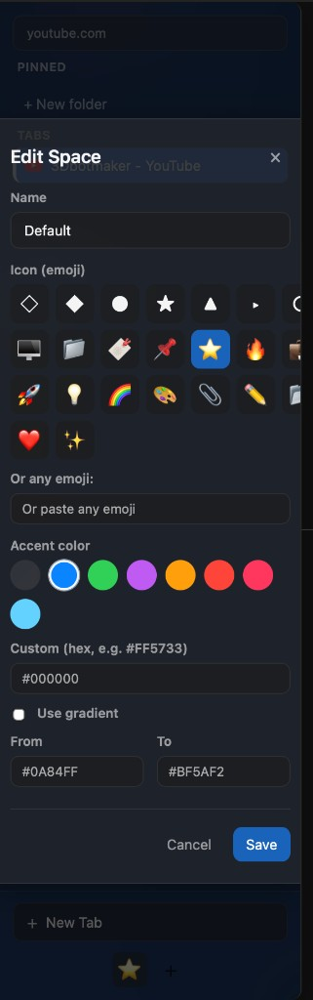

## Arc Power

Arc Power is a Safari Web Extension that adds an Arc‑style vertical sidebar and command bar to Safari on macOS. This repository contains the Swift host app, the Safari Web Extension, and a small packaged sample for distribution.

> **Vibe-coded:** This project was built with AI assistance and a human directing it. Human development is welcome — whether you prefer to refine the vibe, fix bugs, or add features, contributions and forks are encouraged.

### Screenshots

| Edit Space — name, icon, and accent color | Sidebar with search overlay |
|------------------------------------------|-----------------------------|
|  |  |

| Sidebar with pinned/tabs | Sidebar with command search |
|--------------------------|-----------------------------|
|  |  |

### Requirements

- macOS 13 or later
- Xcode 15 or later
- Safari 17 or later

### Project layout

- `ArcifySafari/` – minimal macOS wrapper app used so Safari can load the web extension.
- `ArcifySafari Extension/` – the Safari Web Extension (JavaScript, HTML, CSS).
- `ArcifySafari-Packaged/` – a packaged example app + extension bundle used for distribution.

### Building and running

1. Open **Arc Power.xcodeproj** in `ArcifySafari-Packaged/Arcify Safari/` in Xcode.
2. Select the **Arc Power** scheme.
3. In the target’s **Signing & Capabilities** tab:
   - Set **Team** to your own Apple Developer team.
   - Change the **Bundle Identifier** for both the app and the extension to something you own (for example `com.yourcompany.ArcPower` and `com.yourcompany.ArcPower.Extension`).
4. Build and run the **Arc Power** app. It will launch silently – there is no main window for normal use.

### Enabling the extension in Safari

1. Open **Safari**.
2. Go to **Settings → Extensions**.
3. Enable **Arc Power**.
4. Grant it permission to run “on all websites” so the sidebar can appear everywhere.

Once enabled, use the Arc Power toolbar button or your configured keyboard shortcuts (⌘B for panel, ⌘K for command bar) to toggle the sidebar and command bar.

### Secrets and configuration

This project is intended to be safe for public hosting:

- There are **no hard‑coded API keys or tokens** in the repository.
- The packaged sample app uses a configurable extension bundle identifier that can be supplied via a local `Secrets.plist` file.
- A template file `Secrets.template.plist` is provided at the repository root. To use it:
  1. Copy it to `Secrets.plist`.
  2. Fill in `ExtensionBundleIdentifier` with your own extension bundle identifier (it must match the Web Extension target in Xcode).
  3. Keep `Secrets.plist` out of git – it is already listed in `.gitignore`.

You can add any future API keys or private tokens to `Secrets.plist` instead of hard‑coding them in source.

### Native menu vs. HTML popover

Safari Web Extensions render their popovers using HTML/CSS/JS. This project keeps that original behavior but also includes a small native `NSMenu` implementation in `SafariWebExtensionHandler.swift`:

- When the web extension sends a native message `{ command: "show-menu", context: {...} }`, the native host shows an `NSMenu` containing:
  - **Copy Link**
  - **Duplicate**
  - **Pin**
  - a separator
  - a **MOVE TO** section with **New folder...**

When you right‑click a tab in the sidebar, the extension first tries to show this native menu (via `browser.runtime.sendNativeMessage("Arc Power", { command: "show-menu", context })`). If the native host is unavailable or the user dismisses the menu, it falls back to the HTML context menu. The application name `"Arc Power"` must match your host app’s configuration for native messaging to work.

### Signing and contributing

To build this project with your own Apple Developer account:

- In **each Xcode project** you intend to build:
  - Set **Signing & Capabilities → Team** to your own team.
  - Change all **Bundle Identifier** values to a prefix you control.
- If you use the packaged sample host UI, set `ExtensionBundleIdentifier` in a local `Secrets.plist` to match your extension’s bundle identifier.

Pull requests are welcome for:

- Bug fixes and performance improvements.
- Better theming or UX for the sidebar and command bar.
- Additional documentation and examples.

# Arc Power

Arc-style vertical tab panel for Safari: Spaces, pinned tabs, search, and ⌘B toggle.

## How to run (use the Packaged project)

The extension only shows up in Safari when you build and run the **packager-generated** project:

1. **Open the correct Xcode project**  
   In Finder go to: **ArcifySafari** → **ArcifySafari-Packaged** → **Arcify Safari**  
   Double-click **Arc Power.xcodeproj**.

2. **Quit Safari** completely (Safari → Quit Safari, or ⌘Q).

3. **Run the app from Xcode**  
   Select the **Arc Power** scheme and press **Run** (⌘R). The app will launch (you may see a small window). Leave it running.

4. **Open Safari** and go to **Safari → Settings → Extensions**.  
   You should see **Arc Power Extension**. Check the box to enable it.

5. **Use the panel**  
   Open any webpage and press **⌘B** to show or hide the vertical tab panel.

**If the extension still doesn’t appear:** Turn on **Safari → Settings → Advanced → Show features for web developers**, then **Safari → Settings → Developer → Allow unsigned extensions**. Quit Safari, run the app from Xcode again, then open Safari.

### DMG and PKG downloads (distribution)

You can build a **DMG** (drag-to-Applications disk image) or **PKG** (installer package) for distribution so users can install without Xcode.

From the **repository root** (with Xcode and the project already set up for signing):

```bash
# DMG – users open it and drag “Arc Power” to Applications
./scripts/create-dmg.sh 1.0
# Creates: Arc-Power-1.0.dmg

# PKG – users double-click to run the installer
./scripts/create-pkg.sh 1.0
# Creates: Arc-Power-1.0.pkg
```

Pass a version string (e.g. `1.0` or `1.2.3`) or leave it out to default to `1.0`. After building, enable the extension in **Safari → Settings → Extensions** as above. For GitHub Releases, attach the DMG and/or PKG to a release so users can download and install directly.

## Project structure

- **ArcifySafari-Packaged/Arcify Safari/** – Xcode project that registers with Safari (use this one).
- **ArcifySafari/** – Original wrapper app (optional).
- **ArcifySafari Extension/** – Web extension source (manifest, JS, CSS); same code is in the Packaged project’s extension folder.

## Features

- **Spaces** – Switch and create tab groups (saved per space).
- **Pinned tabs** – Separate section; right-click a tab → Pin/Unpin.
- **Search** – Filter tabs by title.
- **Drag-and-drop** – Reorder tabs in pinned and regular lists.
- **Right-click** – Pin/Unpin or Edit URL.
- **Storage** – Spaces and pinned tabs persist in `browser.storage.local` across sessions.

## File roles

| File | Purpose |
|------|--------|
| `manifest.json` | Extension config: permissions, commands (⌘B), content scripts. |
| `background.js` | Handles ⌘B and all `browser.tabs` / `browser.storage`. |
| `content.js` | Builds the panel UI; sends messages to background for data. |
| `ui.css` | Dark theme for the panel. |
| `popup.html` | Popup when you click the toolbar icon. |
